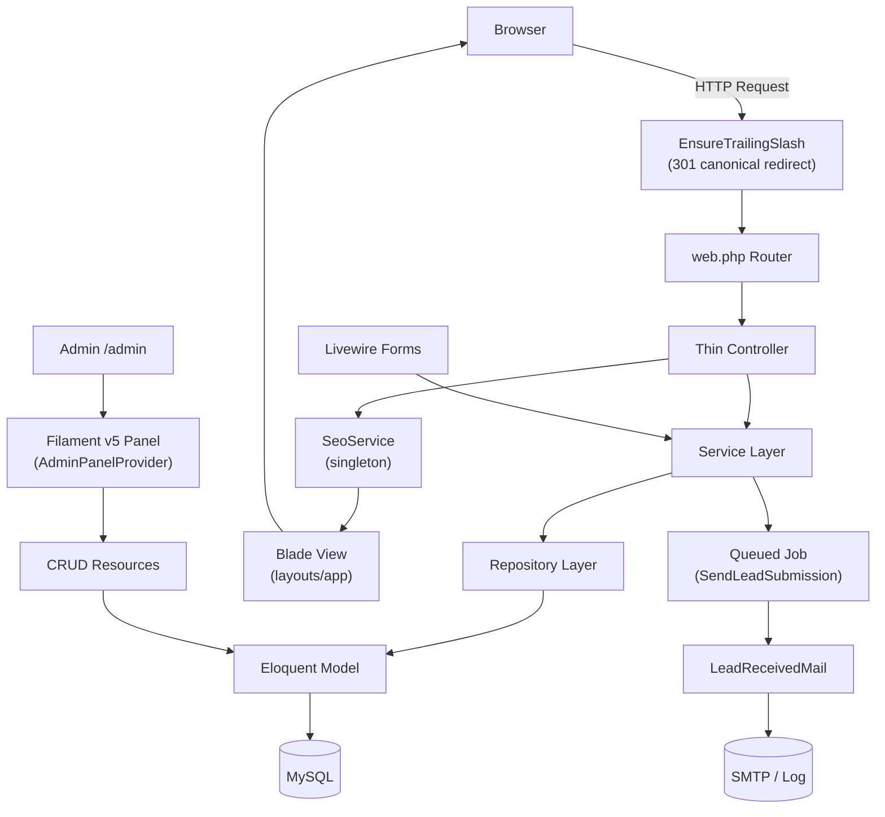

# IBN Technologies — Laravel CMS

> A production-grade, Blade-first CMS built on Laravel 12 with clean architecture, rich content types, gated asset downloads, and a Filament v5 admin panel.

---

## Table of Contents

1. [Project Overview](#1-project-overview)
2. [Features & Modules](#2-features--modules)
3. [Technology Stack](#3-technology-stack)
4. [Architecture & Directory Structure](#4-architecture--directory-structure)
5. [Installation & Setup](#5-installation--setup)
6. [Environment Variables](#6-environment-variables)
7. [Database: Migrations & Seeding](#7-database-migrations--seeding)
8. [Queue & Background Jobs](#8-queue--background-jobs)
9. [Storage, Caching, Logging & Mail](#9-storage-caching-logging--mail)
10. [Authentication & Authorization](#10-authentication--authorization)
11. [Admin Panel (Filament)](#11-admin-panel-filament)
12. [Frontend Assets](#12-frontend-assets)
13. [SEO System](#13-seo-system)
14. [Lead Capture System](#14-lead-capture-system)
15. [Media Library](#15-media-library)
16. [Artisan Commands](#16-artisan-commands)
17. [Development Workflow](#17-development-workflow)
18. [Testing](#18-testing)
19. [Favicons](#19-favicons)
20. [Deployment Notes](#20-deployment-notes)
21. [Coding Standards & Conventions](#21-coding-standards--conventions)
22. [Troubleshooting](#22-troubleshooting)
23. [License](#23-license)

---

## 1. Project Overview

IBN Technologies Laravel CMS is a full-featured content management system originally designed as a clean, scalable alternative to WordPress. It is built with a **Blade-first** approach — thin controllers delegate to Service and Repository layers, and all views use reusable Blade section components.

The CMS manages multiple content types (Blog, Articles, Case Studies, eBooks, White Papers, Press Releases, Landing Pages, Industry Pages, Newsletter Issues, and generic CMS Pages), a lead capture pipeline, and a comprehensive SEO metadata system — all managed via the **Filament v5** admin panel.

---

## 2. Features & Modules

### Content Types
| Module | Routes | Download Support |
|---|---|---|
| **Pages** (CMS) | `/{slug}` | — |
| **Blog** | `/blog`, `/blog/{slug}`, `/blog/category/{slug}` | — |
| **Articles** | `/articles`, `/articles/{slug}` | — |
| **Case Studies** | `/case-studies`, `/case-studies/{slug}`, `/case-studies/{slug}/download` | ✅ PDF gated download |
| **eBooks** | `/ebooks`, `/ebooks/{slug}`, `/ebooks/{slug}/download` | ✅ PDF gated download |
| **White Papers** | `/white-papers`, `/white-papers/{slug}` | — |
| **Press Releases** | `/press-releases`, `/press-releases/{slug}` | — |
| **Industry Pages** | `/industry/{slug}` | — |
| **Landing Pages** | `/lp/{slug}` | — |
| **Newsletter Issues** | `/newsletter`, `/newsletter/{slug}` | — |

### Lead & Form Capture
- **Contact Form** — name, email, phone (intl), company, message, terms acceptance
- **Lead Form** — simplified name, email, company capture
- **Newsletter Inquiry Form** — email-only opt-in
- **eBook Download Form** — gated PDF access with lead capture
- **Case Study Download Form** — gated PDF access with lead capture
- All forms are **Livewire v4** components with server-side validation
- Every submission dispatches an async queue job (`SendLeadSubmissionNotification`) to send an email notification

### SEO System
- Per-model polymorphic `seo_meta` records
- Meta title, description, keywords, focus keyword, SEO score
- Open Graph (og:title, og:description, og:image, og:image_alt, og:type, og:locale, og:site_name)
- Twitter Card (card type, title, description, image, creator, site)
- Canonical URL, robots (index/follow/max-snippet/max-image-preview), custom meta robots
- Article metadata (author, published_at, modified_at, section, tags, reading_time)
- JSON-LD structured data (auto-generated or manual override)
- FAQ schema, sitemap inclusion flag, redirect URL, custom head code injection

### AI-Ready Content Utilities (`AiService`)
- `generateSeo(title, content)` — auto-generates meta title + description + OG fields from content
- `suggestKeywords(content)` — extracts top 10 keywords by word frequency
- `contentOptimization(content)` — returns word count, readability hints, and CTA guidance

> **Note:** `AiService` contains local heuristic logic only. No external AI API is wired up by default.

### Admin Panel
- Custom **IBNTECH Control** branded Filament v5 panel at `/admin`
- Dashboard with content overview, quick actions, recent activity, and recent leads widgets
- **Queue Monitor** — real-time view of database queue backlog and failed jobs (admin-only)
- **Log Viewer** — view application log entries from the admin panel
- CRUD for all content types with block-content editor and SEO meta schema
- Role-based access: `administrator` and `author` roles

### Categories & Tags
- Categories support **parent/child hierarchy** (nested)
- Categories are scoped per module (`blog`, `case_study`, `ebook`, `press_release`, `white_paper`, `article`)
- Tags available for Blog posts (many-to-many)

---

## 3. Technology Stack

### Backend
| Package | Version |
|---|---|
| PHP | `^8.2` |
| Laravel Framework | `^12.0` |
| Livewire | `~4.0` |
| Filament | `~5.0` |
| Filament Spatie Media Library Plugin | `~5.0` |
| Spatie Laravel Media Library | `^11.21` |
| Laravel Telescope | `5.20` |
| Laravel Tinker | `^2.10.1` |

### Dev Dependencies
| Package | Version |
|---|---|
| Laravel Debugbar | `4.2.8` |
| Faker PHP | `^1.23` |
| Laravel Pail (log streaming) | `^1.2.2` |
| Laravel Pint (code style) | `^1.24` |
| Laravel Sail (Docker) | `^1.41` |
| Mockery | `^1.6` |
| Collision | `^8.6` |
| PHPUnit | `^11.5.50` |

### Frontend
| Package | Version |
|---|---|
| Vite | `^7.0.7` |
| Laravel Vite Plugin | `^2.0.0` |
| Tailwind CSS | `^4.0.0` |
| `@tailwindcss/vite` | `^4.0.0` |
| Axios | `^1.11.0` |
| intl-tel-input | `^27.2.1` |
| concurrently | `^9.0.1` |

### Database & Infrastructure
- **Database:** MySQL (default), SQLite for tests
- **Sessions:** Database driver
- **Cache:** Database driver (default); Redis supported
- **Queue:** Database driver (default); Redis supported
- **Broadcast:** Log driver (default)
- **Filesystem:** Local (default); AWS S3 supported

---

## 4. Architecture & Directory Structure

```
app/
├── Casts/
│   └── BlockContentCast.php          # Cast for JSON block content
├── Filament/
│   ├── Auth/Login.php                 # Custom Filament login page
│   ├── Pages/
│   │   ├── AdminDashboard.php         # CMS control center dashboard
│   │   ├── LogViewer.php              # Log viewing admin page
│   │   └── QueueMonitor.php           # Queue health admin page
│   ├── Resources/                     # CRUD resources (16 content types)
│   │   ├── Articles/, Blogs/, CaseStudies/, Categories/
│   │   ├── Ebooks/, Industries/, LandingPages/, Leads/
│   │   ├── Newsletters/, Pages/, PressReleases/
│   │   ├── Users/, WhitePapers/, ...
│   ├── Schemas/
│   │   ├── ContentBuilder.php         # Shared block-content editor schema
│   │   └── SeoMetaSchema.php          # Shared SEO meta form schema
│   └── Widgets/
│       ├── AdminQuickActionsWidget.php
│       ├── ContentOverviewWidget.php
│       ├── RecentActivityWidget.php
│       └── RecentLeadsWidget.php
├── Forms/Components/                  # Custom Filament form components
├── Helpers/
│   └── TemplateHelper.php             # Auto-discovers blade templates per directory
├── Http/
│   ├── Controllers/                   # Thin controllers (12 total)
│   │   ├── BlogController.php
│   │   ├── ArticleController.php
│   │   ├── CaseStudyController.php
│   │   ├── EbookController.php
│   │   ├── WhitePaperController.php
│   │   ├── PressReleaseController.php
│   │   ├── IndustryController.php
│   │   ├── LandingPageController.php
│   │   ├── NewsletterController.php
│   │   ├── PageController.php
│   │   ├── ContactController.php
│   │   └── ...
│   ├── Middleware/
│   │   └── EnsureTrailingSlash.php    # 301 redirect for trailing-slash consistency
│   └── Requests/
├── Jobs/
│   └── SendLeadSubmissionNotification.php  # Queued email notification
├── Livewire/
│   └── Forms/
│       ├── ContactForm.php
│       ├── LeadForm.php
│       ├── NewsletterInquiryForm.php
│       ├── EbookDownloadForm.php
│       └── CaseStudyDownloadForm.php
├── Mail/
│   └── LeadReceivedMail.php           # Markdown mailable for lead notifications
├── Models/
│   ├── Concerns/HasBlockContent.php   # Trait: block content casting + media cleanup
│   ├── Article.php
│   ├── Blog.php                       # Reference media library implementation
│   ├── CaseStudy.php
│   ├── Category.php                   # Hierarchical, module-scoped
│   ├── Ebook.php
│   ├── Industry.php
│   ├── LandingPage.php
│   ├── Lead.php                       # table: form_submissions
│   ├── Media.php
│   ├── Newsletter.php
│   ├── Page.php
│   ├── PressRelease.php
│   ├── SeoMeta.php                    # Polymorphic SEO meta
│   ├── Tag.php
│   ├── User.php
│   └── WhitePaper.php
├── Providers/
│   ├── AppServiceProvider.php         # SeoService singleton; queue event listeners
│   ├── TelescopeServiceProvider.php
│   └── Filament/AdminPanelProvider.php
├── Repositories/                      # Data access layer (11 repositories)
├── Services/                          # Business logic layer (13 services)
│   ├── AiService.php
│   ├── BlogService.php
│   ├── LeadService.php
│   ├── SeoService.php
│   └── ...
└── Support/
    ├── BlockContent.php               # Block-content renderer & plain-text extractor
    ├── Filesystem/MediaRoot.php       # Resolves MEDIA_ROOT (relative or absolute)
    └── MediaLibrary/                  # Purpose-based path generator

resources/
├── css/
│   ├── app.css                        # Main frontend CSS (Tailwind v4)
│   └── filament/admin/theme.css       # Custom Filament admin theme
├── js/app.js                          # Main JS entry (Axios, intl-tel-input)
└── views/
    ├── articles/, blog/, case-studies/
    ├── components/                    # Reusable Blade section components
    ├── ebooks/, emails/, errors/
    ├── filament/                      # Filament view hooks & dashboard views
    ├── industries/, landing-pages/
    ├── layouts/app.blade.php          # Main public layout (SEO meta injected)
    ├── livewire/                      # Livewire component views
    ├── newsletters/, pages/
    ├── press-releases/, sections/
    └── white-papers/

routes/
├── web.php                            # All public routes
└── console.php                        # Artisan command definitions

database/
├── migrations/                        # 33 migration files
├── seeders/
│   ├── DatabaseSeeder.php
│   └── CmsDemoSeeder.php              # Demo pages, blogs, case studies, ebooks, etc.
└── factories/

public/
├── index.php                          # Loads bootstrap-path.php, then the core
├── bootstrap-path.php                 # Host → Laravel core path
├── build/                             # Tracked Vite output (npm run build)
├── uploads/                           # Local MEDIA_ROOT; file contents are gitignored
└── robots.txt                         # Local copy. Deploy does not copy it

deploy.sh                                # cPanel deploy script (same on staging and main)
.cpanel.yml                              # Runs /bin/bash $PWD/deploy.sh
deploy-config.sh.example                 # Template only. The filled file stays on the server

docs/
├── DEPLOYMENT-GitHub-GUIDE.md         # Git + cPanel deploy
├── PRODUCTION_DEPLOYMENT.md           # Server requirements, cron, permissions
├── media-uploads-deployment.md        # MEDIA_ROOT per environment
└── media-library-architecture.md      # Folder map under the media disk
```

`vendor/` and `node_modules/` are not in Git. Composer and npm install them locally. The server runs `composer install` and does not need Node when `public/build/` is already in Git.

### Server layout

The Laravel core is not the website document root. `public/bootstrap-path.php` selects the core from the request host.

| | Local | Staging | Production |
|---|---|---|---|
| Host | `localhost` / `127.0.0.1` | `dev.ibntech.com` | `ibntech.com`, `www.ibntech.com` |
| Laravel core | project root | `/home/devtech/ibntech-core/` | `/home/ibntech/ibntech-core/` |
| Document root | `public/` | `/home/devtech/public_html/` | `/home/ibntech/public_html/` |
| `MEDIA_ROOT` | `public/uploads` | `/home/devtech/public_html/uploads` | `/home/ibntech/public_html/uploads` |

On the servers, `public_path()` is `ibntech-core/public`. Apache serves `public_html`. Deploy publishes web assets to both. Media stays only in `public_html/uploads`.

### Architecture Diagram



---

## 5. Installation & Setup

### Prerequisites
- PHP `^8.2` with extensions: `pdo_mysql`, `mbstring`, `openssl`, `tokenizer`, `xml`, `ctype`, `json`, `bcmath`, `fileinfo`
- Composer `^2`
- Node.js `^18` + npm
- MySQL `^8` (or MariaDB `^10.6`)

### Quick Start (one-liner)

```bash
composer setup
```

This runs: `composer install` → `.env` copy → `key:generate` → `migrate` → `npm install` → `npm run build`

### Manual Step-by-Step

```bash
# 1. Clone the repository
git clone <repository-url> ibntech-laravel
cd ibntech-laravel

# 2. Install PHP dependencies
composer install

# 3. Configure environment
cp .env.example .env
php artisan key:generate

# 4. Edit .env with your database and mail settings
#    (see section 6 below)

# 5. Run migrations
php artisan migrate

# 6. (Optional) Seed demo content
php artisan db:seed

# 7. Ensure media uploads directory exists (no storage:link required)
#    Local: MEDIA_DISK=media, MEDIA_ROOT=public/uploads, MEDIA_URL=/uploads

# 8. Install Node dependencies
npm install

# 9. Build frontend assets
npm run build          # production
# or
npm run dev            # watch mode
```

### Run Dev Server

```bash
composer dev
```

This starts **four concurrent processes** in colour-coded terminals:
- `php artisan serve` — Laravel dev server
- `php artisan queue:listen --tries=1 --timeout=0` — queue worker
- `php artisan pail --timeout=0` — live log streaming
- `npm run dev` — Vite HMR

---

## 6. Environment Variables

Copy `.env.example` to `.env` and configure the following variables:

### Application

| Variable | Default | Notes |
|---|---|---|
| `APP_NAME` | `Laravel` | Used in SEO meta titles, email sender name |
| `APP_ENV` | `local` | Set to `production` for live environments |
| `APP_KEY` | _(empty)_ | Run `php artisan key:generate` |
| `APP_DEBUG` | `true` | Set to `false` in production |
| `APP_URL` | `http://localhost` | Must match your domain |
| `DEBUGBAR_ENABLED` | `true` | Set to `false` in production |

### Logging

| Variable | Default |
|---|---|
| `LOG_CHANNEL` | `daily` |
| `LOG_LEVEL` | `debug` |
| `LOG_DAILY_DAYS` | `30` |

### Database

| Variable | Default |
|---|---|
| `DB_CONNECTION` | `mysql` |
| `DB_HOST` | `127.0.0.1` |
| `DB_PORT` | `3306` |
| `DB_DATABASE` | `ibntech_laravel_12` |
| `DB_USERNAME` | `root` |
| `DB_PASSWORD` | _(empty)_ |

### Session, Cache & Queue

| Variable | Default | Notes |
|---|---|---|
| `SESSION_DRIVER` | `database` | |
| `SESSION_LIFETIME` | `120` | Minutes |
| `CACHE_STORE` | `database` | Can be `redis` |
| `QUEUE_CONNECTION` | `database` | Can be `redis` |
| `QUEUE_FAILED_DRIVER` | `database-uuids` | |
| `QUEUE_MONITOR_MAX` | `100` | Backlog threshold for queue monitor alert |

### Redis (optional)

| Variable | Default |
|---|---|
| `REDIS_CLIENT` | `phpredis` |
| `REDIS_HOST` | `127.0.0.1` |
| `REDIS_PASSWORD` | `null` |
| `REDIS_PORT` | `6379` |

### Mail

| Variable | Default | Notes |
|---|---|---|
| `MAIL_MAILER` | `log` | Change to `smtp` for production |
| `MAIL_HOST` | `127.0.0.1` | |
| `MAIL_PORT` | `2525` | |
| `MAIL_USERNAME` | `null` | |
| `MAIL_PASSWORD` | `null` | |
| `MAIL_FROM_ADDRESS` | `hello@example.com` | |
| `MAIL_FROM_NAME` | `${APP_NAME}` | |
| `MAIL_LEAD_NOTIFICATION_TO` | `admin@example.com` | Recipient for lead notifications |

### Laravel Telescope

| Variable | Default |
|---|---|
| `TELESCOPE_ENABLED` | `true` |

### AWS S3 (optional)

| Variable | Notes |
|---|---|
| `AWS_ACCESS_KEY_ID` | Required for S3 storage |
| `AWS_SECRET_ACCESS_KEY` | |
| `AWS_DEFAULT_REGION` | `us-east-1` |
| `AWS_BUCKET` | |
| `AWS_USE_PATH_STYLE_ENDPOINT` | `false` |

### Media disk

| Variable | Local default | Server |
|---|---|---|
| `MEDIA_DISK` | `media` | `media` |
| `MEDIA_ROOT` | `public/uploads` | Absolute `public_html/uploads` path for that account |
| `MEDIA_URL` | `/uploads` | `/uploads` |

A relative `MEDIA_ROOT` is resolved from the Laravel base path. On cPanel that would write into `ibntech-core/public/uploads`, which Apache does not serve. Staging and production `.env` files use the absolute `public_html/uploads` path.

### Vite

| Variable | Default |
|---|---|
| `VITE_APP_NAME` | `${APP_NAME}` |

### Google reCAPTCHA v2 (Checkbox)

| Variable | Notes |
|---|---|
| `RECAPTCHA_SITE_KEY` | Public site key for Google reCAPTCHA v2 Checkbox |
| `RECAPTCHA_SECRET_KEY` | Secret key for backend server-side verification |

---

## 7. Database: Migrations & Seeding

### Running Migrations

```bash
# Fresh install (first time) or a later additive migration
php artisan migrate
```

Do not run `migrate:fresh`, `migrate:refresh`, `migrate:reset`, or `db:wipe` against a database that already has CMS content. Staging and production migrations are a separate step after code deploy, and `deploy.sh` does not run them.

### Migration History

| Migration | Description |
|---|---|
| `create_users_table` | Core users table |
| `create_cache_table` | Database cache driver |
| `create_jobs_table` | Queue jobs + failed_jobs tables |
| `create_pages_table` | CMS pages |
| `create_categories_table` | Shared module-scoped categories |
| `create_tags_table` | Blog tags |
| `create_blogs_table` | Blog posts |
| `create_blog_tag_table` | Blog ↔ Tag pivot |
| `create_leads_table` | Form submissions (renamed → `form_submissions`) |
| `create_seo_meta_table` | Polymorphic SEO metadata |
| `create_media_table` | Spatie Media Library |
| `add_template_to_blogs_table` | Template selector column |
| `create_case_studies_table` | Case studies |
| `create_ebooks_table` | eBooks |
| `add_role_to_users_table` | User roles (`administrator`, `author`) |
| `add_parent_id_to_categories_table` | Hierarchical categories |
| `update_media_table_for_spatie_media_library` | Full Spatie media schema |
| `add_module_to_categories_table` | Module-scoped category filtering |
| `add_extended_seo_fields_to_seo_meta_table` | Full SEO field set |
| `rename_leads_to_form_submissions_table` | Renamed table + added columns |
| `create_press_releases_table` | Press releases |
| `create_white_papers_table` | White papers |
| `create_articles_table` | Articles |
| `create_industries_table` | Industry pages |
| `create_landing_pages_table` | Landing pages |
| `create_newsletters_table` | Newsletter issues |
| `create_telescope_entries_table` | Laravel Telescope |

### Seeding

The `CmsDemoSeeder` seeds fully-formed demo content:

```bash
php artisan db:seed
# or
php artisan db:seed --class=CmsDemoSeeder
```

**Seeded demo data:**
- **Pages:** Home, About Us, Services, Contact, Our Vision
- **Blog posts:** Sample posts with categories and tags
- **Case Studies:** With category assignments
- **eBooks:** With category assignments
- **Press Releases:** Sample entries
- **White Papers:** Sample entries
- **SEO meta:** Pre-filled for each seeded record

---

## 8. Queue & Background Jobs

The application uses the **database queue driver** by default. All lead form submissions trigger an asynchronous job.

### Job: `SendLeadSubmissionNotification`
- Dispatched by `LeadService::createLead()` after every form submission
- Sends `LeadReceivedMail` (Markdown mailable) to the configured recipient
- 3 retry attempts, 30-second timeout
- Dispatched with `afterCommit()` to prevent notification on failed transactions

### Starting the Queue Worker

```bash
# Development (with composer dev, already included)
php artisan queue:listen --tries=1 --timeout=0

# Production (supervised)
php artisan queue:work --tries=3 --timeout=30

# For media-heavy workloads (image conversions)
php artisan queue:work --queue=media,default --tries=1 --timeout=900
```

### Queue Monitor

An admin-only **Queue Monitor** page is available at `/admin/queue-monitor` displaying:
- Pending and reserved jobs per queue
- Total failed jobs count
- Jobs failed in the last 24 hours
- Last 10 failed job exceptions
- Configurable backlog alert threshold (`QUEUE_MONITOR_MAX`)

> **No Laravel Horizon is configured.** Queue management is done via the built-in Filament Queue Monitor page.

### Queue Event Logging (`AppServiceProvider`)

- `JobFailed` events log an error with connection, queue, job class, job ID, and exception details
- `QueueBusy` events log a warning when pending jobs exceed `QUEUE_MONITOR_MAX`

---

## 9. Storage, Caching, Logging & Mail

### Storage

- **Default disk:** `local`
- **Media disk:** `media` (dedicated; root via `MEDIA_ROOT`, URL via `MEDIA_URL`)
- **No symlink required for media.** Local files live in `public/uploads`. On staging and production they live in that account's `public_html/uploads` and are served at `/uploads`
- **Media path layout:** purpose-based folders (see `docs/media-library-architecture.md`), e.g. `logos/website/`, `blogs/featured/{YYYY}/{MM}/`
- **Migration command:** `php artisan media:migrate-to-uploads-disk`
- **Deployment guide:** `docs/media-uploads-deployment.md`
- **AWS S3** disk is pre-configured; set `MEDIA_DISK=s3` to use cloud storage without code changes

### Caching

- **Driver:** `database` (default) — stores entries in the `cache` table
- **Redis** can be enabled by setting `CACHE_STORE=redis`
- No application-level cache tags are used; standard Laravel cache API applies

### Logging

- **Channel:** `daily` — rotates log files, keeps 30 days
- **Log path:** `storage/logs/laravel-YYYY-MM-DD.log`
- **Telescope:** Enabled by default (`TELESCOPE_ENABLED=true`); disable in production with `TELESCOPE_ENABLED=false`
- **Log Viewer:** Filament admin page at `/admin/log-viewer` for viewing logs in the browser

### Mail

- **Default mailer:** `log` — emails are written to the log file (safe for local development)
- **Production:** Set `MAIL_MAILER=smtp` with appropriate SMTP credentials
- **Lead notification recipient:** Configured via `MAIL_LEAD_NOTIFICATION_TO`
- **Mail template:** `resources/views/emails/leads/received.blade.php` (Markdown mailable)

---

## 10. Authentication & Authorization

### Authentication
- Laravel's built-in `Authenticatable` is used for the `User` model
- Authentication is handled exclusively through the **Filament panel** (`/admin/login`)
- No public-facing login/registration UI exists
- Custom `App\Filament\Auth\Login` page extends Filament's default login

### User Roles
Two roles are defined in `User.php`:

| Constant | Value | Description |
|---|---|---|
| `ROLE_ADMINISTRATOR` | `administrator` | Full admin panel access including Queue Monitor |
| `ROLE_AUTHOR` | `author` | Admin panel access, limited to content management |

### Access Control
- `canAccessPanel(Panel $panel)` grants access to users with `administrator` or `author` roles
- The `isAdministrator()` check also includes a hardcoded fallback for `admin@example.com`
- The **Queue Monitor** page is restricted to `isAdministrator()` users only

### Session
- Driver: `database` (sessions stored in `sessions` table)
- Lifetime: 120 minutes (configurable via `SESSION_LIFETIME`)

---

## 11. Admin Panel (Filament)

### Access
- **URL:** `/admin`
- **Default credentials (after seeding):**
  - Email: `admin@example.com`
  - Password: `password`

### Panel Configuration
- Brand name: **IBNTECH Control**
- Custom logo (HTML-based brand lockup with IBN initials)
- Dark/light mode with system default (`ThemeMode::System`)
- Primary color: `#4caf50` (green)
- Info color: `#2e2e80` (dark blue)
- Custom font: Satoshi, Manrope, Inter, Segoe UI
- Collapsible sidebar (18rem expanded, 5rem collapsed)
- Custom Vite theme: `resources/css/filament/admin/theme.css`

### Navigation Groups
| Group | Icon | Contents |
|---|---|---|
| **Workspace** | Squares 2×2 | Dashboard (Control center) |
| **Content** | Document Duplicate | Blogs, Articles, Case Studies, eBooks, White Papers, Press Releases, Pages, Newsletters, Industries, Landing Pages, Categories |
| **Sales** | Chart Bar Square | Leads (Form submissions) |
| **Administration** | Shield Check | Users, Queue Monitor, Log Viewer |

### Dashboard Widgets
- **Content Overview** — published/draft counts per content type
- **Admin Quick Actions** — shortcut buttons for common admin tasks
- **Recent Activity** — latest content changes
- **Recent Leads** — latest form submissions

### CRUD Resources
All 16 content types have full Filament resource CRUD with:
- Block content builder (`ContentBuilder` schema) for body content
- SEO meta editor (`SeoMetaSchema`) on each resource
- Spatie Media Library file upload integration

---

## 12. Frontend Assets

### Vite Entry Points
Configured in `vite.config.js`:

| Entry | Purpose |
|---|---|
| `resources/css/app.css` | Main public frontend stylesheet |
| `resources/css/filament/admin/theme.css` | Custom Filament admin theme |
| `resources/js/app.js` | Main JS bundle (Axios + intl-tel-input) |

### Build Commands

```bash
# Development (with HMR)
npm run dev

# Production build
npm run build
```

### CSS Framework
- **Tailwind CSS v4** via `@tailwindcss/vite` plugin
- Uses the new CSS-based Tailwind v4 configuration approach

### JavaScript
- **Axios** for HTTP requests
- **intl-tel-input v27** for international phone number input formatting in the Contact Form

### Vite Hot Module Reload
- Storage view files are excluded from Vite's file watcher to avoid unnecessary reloads:
  ```js
  server: { watch: { ignored: ['**/storage/framework/views/**'] } }
  ```

---

## 13. SEO System

The `SeoService` is registered as a **singleton** in the service container and auto-injected into `layouts/app.blade.php` via a View Composer.

### How It Works

1. Each controller calls `$this->seoService->setCurrentForModel($model)` or `$this->seoService->setCurrent([...])` with manual data
2. The `View::composer('layouts.app', ...)` in `AppServiceProvider` binds the current SEO state to every view rendering `layouts.app`
3. The layout renders all meta tags, OG tags, Twitter Cards, canonical URL, robots directive, and JSON-LD structured data

### Supported SEO Fields

- `meta_title`, `meta_description`, `meta_keywords`, `focus_keyword`, `seo_score`
- Open Graph: `og_title`, `og_description`, `og_image`, `og_image_alt`, `og_type`, `og_site_name`, `og_locale`
- Twitter: `twitter_card_type`, `twitter_title`, `twitter_description`, `twitter_image`, `twitter_creator`, `twitter_site`
- `canonical_url`, `robots` (index/follow/max-snippet/max-image-preview), `custom_meta_robots`
- Article: `article_author`, `published_at`, `modified_at`, `article_section`, `article_tags`, `reading_time`
- `json_ld` (auto-generated `BlogPosting` schema or manual override)
- `faq_schema`, `sitemap_include`, `redirect_url`, `custom_head_code`

### OG/Twitter Image Resolution
Images are resolved in priority order:
1. Spatie media library `og_image`/`twitter_image` collection on `SeoMeta`
2. Direct URL stored in `og_image`/`twitter_image` column
3. Model's `featuredImageUrl()` method

### XML sitemaps

The site exposes a Laravel-generated sitemap index at `/sitemap.xml` (alias: `/sitemap_index.xml`) plus per-content child sitemaps such as `/page-sitemap.xml` and `/post-sitemap.xml`. URLs are built from `APP_URL` / `url()` / `route()`, so local, staging, and production each emit their own host. Sitemaps are not written as static files under `public/`.

Admins manage sitemap settings from **Website Settings → Sitemap**:

- Enable/disable the sitemap
- Include/exclude `<lastmod>`, `<changefreq>`, and `<priority>`
- Cache TTL
- Add a `Sitemap:` line to `robots.txt` (existing Allow/Disallow rules are not rewritten)
- Per content-type enablement and defaults
- Custom URLs (`custom-sitemap.xml`), which preserve query strings

Per-record exclusion still uses the existing SEO **Include in sitemap** toggle, plus `noindex`, `redirect_url`, and canonical mismatch. Child sitemaps split at 50,000 URLs (`post-sitemap.xml`, `post-sitemap2.xml`, …). Cache keys are invalidated per content type when CMS or SEO records change.

---

## 14. Lead Capture System

### Flow

```
Livewire Form Submit
  → LeadService::createLead()
    → LeadRepository::create() → form_submissions table
    → SendLeadSubmissionNotification::dispatch(id, recipient) (queued)
      → LeadReceivedMail → SMTP/Log
```

### Form Types & `form_name` Values
| `form_name` | Source Component |
|---|---|
| `contact` | `ContactForm` |
| `lead` | `LeadForm` |
| `newsletter_inquiry` | `NewsletterInquiryForm` |
| `ebook_download` | `EbookDownloadForm` |
| `case_study_download` | `CaseStudyDownloadForm` |

### Lead Model (`form_submissions` table)
Fields captured per submission: `name`, `email`, `phone`, `company`, `form_name`, `message`, `page_url`, `user_agent`, `ip_address`, `payload` (JSON).

Accessor attributes: `form_label`, `job_title` (from payload), `asset_title` (from payload).

### Phone Validation
The Contact Form enforces E.164 format:
```
regex:/^\+[1-9]\d{6,14}$/
```
Combined with `intl-tel-input` on the frontend for country dial-code assistance.

### Spam Protection (reCAPTCHA)
All public-facing forms require Google reCAPTCHA v2 (Checkbox) verification before they can be submitted.
- **Backend Trait (`App\Livewire\Concerns\HasReCaptcha`):** Standardizes validation rule checks and reset event dispatching (`reset-recaptcha`).
- **Validation Rule (`App\Rules\ReCaptcha`):** Calls Google siteverify endpoint to verify the user-submitted token.
- **Blade Component (`<x-forms.recaptcha>`):** Leverages Alpine.js to dynamically initialize reCAPTCHA and reset the widget after successful form submission.
- **Unit Testing:** In the `testing` environment, reCAPTCHA validation rules are bypassed to ensure automated tests continue to execute smoothly.

---

## 15. Media Library

Powered by **Spatie Laravel Media Library v11** with Filament integration.

### Storage layout

Files are written on the `media` disk. Locally that is `public/uploads`. On the servers it is `public_html/uploads`. Purpose folders come from `config/media-library.php`:

```text
uploads/
├── logos/website|branding
├── seo/og-images|social-share
├── pages/{slug}/
├── blogs/featured|blocks/{YYYY}/{MM}/
├── articles/...
├── case-studies/...
├── ebooks/...
├── media/downloads/...
└── media/miscellaneous/{YYYY}/{MM}/   ← fallback
```

`storage/app/public` is the Laravel `public` disk. It is not the live media root. Spatie temporary conversions use `storage/media-library/temp/` inside the core. That directory is gitignored, and deploy does not sync `storage/`.

### Blog Model — Reference Implementation
The `Blog` model is the reference for media library patterns:
- `featured_image` collection: single file, WebP `hero` (1600×900) and `thumb` (480×320) conversions, responsive images, queued
- `content_blocks` collection: inline block editor images

### Media Conversions
- All image conversions are **queued** to avoid blocking web requests
- Format: **WebP** for all conversions (quality 80–82)
- Conversion sizes: Hero `1600×900` (crop), Thumb `480×320` (crop)

### Queue Recommendation for Media
```bash
php artisan queue:work --queue=media,default --tries=1 --timeout=900
```
Set `MEDIA_QUEUE_CONNECTION` and `MEDIA_QUEUE=media` in `.env` for dedicated media processing.

---

## 16. Artisan Commands

### Custom Commands (defined in `routes/console.php`)

| Command | Description |
|---|---|
| `php artisan cms:optimize` | Caches config, routes, and views for production performance (**run on the server only after deploy; never upload the resulting `bootstrap/cache/*.php` files**) |
| `php artisan inspire` | Displays an inspiring quote |

### Standard Laravel Commands (frequently used)

```bash
# Clear caches
php artisan config:clear
php artisan route:clear
php artisan view:clear

# Cache for production (server only — do not run locally before a Git deploy)
php artisan optimize:clear
php artisan cms:optimize

# Queue management
php artisan queue:work
php artisan queue:listen
php artisan queue:failed
php artisan queue:retry all

# Telescope
php artisan telescope:prune   # Prune old telescope data
php artisan telescope:clear   # Clear all telescope data

# Filament
php artisan filament:upgrade
```

---

## 17. Development Workflow

### Starting Development

```bash
composer dev
```

Runs all four concurrent processes: web server, queue worker, log streamer, and Vite HMR.

### Code Style

```bash
# Check and auto-fix code style (Laravel Pint / PSR-12)
./vendor/bin/pint

# Check only (no fixes)
./vendor/bin/pint --test
```

### IDE / Editor Config

An `.editorconfig` is included at the project root. The `.styleci.yml` defines CI style rules aligned with Laravel conventions.

### Adding a New Content Type

1. Create a **Migration** in `database/migrations/`
2. Create an **Eloquent Model** in `app/Models/` — use `HasBlockContent` trait if it has rich content; implement `HasMedia` if it needs file attachments
3. Create a **Repository** in `app/Repositories/`
4. Create a **Service** in `app/Services/`
5. Create a **Controller** in `app/Http/Controllers/`
6. Register **routes** in `routes/web.php`
7. Create **Filament Resource** in `app/Filament/Resources/`
8. Create **Blade views** in `resources/views/<content-type>/`

### Adding a New Blade Template

Templates for `Page`, `Industry`, `LandingPage`, and `Newsletter` content types are auto-discovered from their respective view directories. Simply create a new `.blade.php` file in the correct directory, and `TemplateHelper` will pick it up automatically in Filament's template selector.

---

## 18. Testing

### Test Suites

| Suite | Directory | Tests |
|---|---|---|
| Feature | `tests/Feature/` | 7 test files |
| Unit | `tests/Unit/` | 8 test files |

### Feature Tests
- `EnsureTrailingSlashTest` — middleware 301 redirect behaviour
- `ExampleTest` — basic app health check
- `FormSubmissionTest` — form submission to database
- `IndustryPageTest` — industry page routing
- `LandingPageTest` — landing page routing
- `LivewireFormSubmissionTest` — Livewire component submission
- `NewsletterPageTest` — newsletter page routing

### Unit Tests
- `BlockContentTest` — block content rendering and parsing
- `CustomPathGeneratorTest` — Spatie media path generator
- `SeoServiceTest` — SEO service defaults and model binding
- `SpatieMediaLibraryFileUploadTest` — media upload component
- `TemplateHelperTest` — template options discovery
- `LandingPageTemplateHelperTest` / `NewsletterTemplateHelperTest`

### Test Environment
Tests use an **in-memory SQLite** database (configured in `phpunit.xml`). Telescope and Debugbar are disabled during tests.

### Running Tests

```bash
# All tests
composer test
# or
php artisan test

# Specific suite
php artisan test --testsuite=Unit
php artisan test --testsuite=Feature

# Specific test file
php artisan test tests/Unit/SeoServiceTest.php
```

---

## 19. Favicons

- **Placement:** Extract the package generated by [RealFaviconGenerator](https://realfavicongenerator.net/) into `public/favicon_io/`
- **Front-end:** Favicon links are added to [`resources/views/layouts/app.blade.php`](resources/views/layouts/app.blade.php)
- **Admin (Filament):** Favicons are injected into admin pages via the Filament head hook view [`resources/views/filament/hooks/head.blade.php`](resources/views/filament/hooks/head.blade.php) and registered in [`app/Providers/Filament/AdminPanelProvider.php`](app/Providers/Filament/AdminPanelProvider.php)
- **Verify:** After placing files, visit the site and check the browser tab, or use `npx realfavicongenerator check <port>` for local verification

---

## 20. Deployment Notes

Releases go through Git and cPanel, not a zip of the working tree.

- [`docs/DEPLOYMENT-GitHub-GUIDE.md`](docs/DEPLOYMENT-GitHub-GUIDE.md) — deploy runbook
- [`docs/PRODUCTION_DEPLOYMENT.md`](docs/PRODUCTION_DEPLOYMENT.md) — requirements, cron, permissions
- [`docs/media-uploads-deployment.md`](docs/media-uploads-deployment.md) — `MEDIA_ROOT` per environment

One repository. Branch `staging` deploys to `dev.ibntech.com`. Branch `main` deploys to `ibntech.com`. `.cpanel.yml` runs `/bin/bash $PWD/deploy.sh`. Paths live only in the server file `deploy-config.sh`.

| | Staging | Production |
|---|---|---|
| Core | `/home/devtech/ibntech-core/` | `/home/ibntech/ibntech-core/` |
| Document root | `/home/devtech/public_html/` | `/home/ibntech/public_html/` |
| Git clone | `/home/devtech/repositories/ibntech-laravel` | Branch `main`. Not `public_html` and not `ibntech-core` |
| PHP | `/usr/local/bin/ea-php84` | That account's EasyApache binary |

`deploy.sh` copies application code into `ibntech-core`, runs `composer install` there, and publishes `build/`, `css/`, `js/`, `fonts/`, `images/`, `favicon_io/`, favicon files, `index.php`, and `bootstrap-path.php` to both `ibntech-core/public/` and `public_html/`.

It does not copy, overwrite, or delete:

- `.env` and `.env.*`
- `.htaccess` (staging and production files differ)
- `storage/`
- `public/uploads/` and `public_html/uploads/`
- `public/hot`
- `public/robots.txt` (the CMS writes `ibntech-core/public/robots.txt`; Apache serves `public_html/robots.txt`)
- `bootstrap/cache/*.php`

Do not run `config:cache` or `cms:optimize` on Windows before pushing. A Windows `bootstrap/cache/config.php` breaks Linux. The script rebuilds those caches on the server. It does not run migrations. After a release that contains new migrations, run `php artisan migrate --force` once for that environment, then remove any one-time cron used to do it.

### Before the first push

```bash
npm ci
npm run build
```

Commit `public/build/`. Do not commit `.env`, `vendor/`, `node_modules/`, or `public/hot`.

### Queue worker

Shared hosting uses a cPanel cron, not Supervisor. Staging example, every one to five minutes:

```bash
/usr/local/bin/ea-php84 /home/devtech/ibntech-core/artisan queue:work database --queue=media,default --stop-when-empty --tries=3 --timeout=900 >> /dev/null 2>&1
```

Production uses `/home/ibntech/ibntech-core/artisan` and that account's PHP binary. The scheduler cron is `schedule:run` every minute. See `docs/PRODUCTION_DEPLOYMENT.md`.

### Telescope in Production
By default, Telescope is enabled. In `TelescopeServiceProvider`, the `gate()` method restricts access. For production, either:
- Set `TELESCOPE_ENABLED=false` to disable entirely
- Or restrict access to specific emails/IPs in `TelescopeServiceProvider::gate()`

### Redis (Optional, Recommended for Production)
```env
CACHE_STORE=redis
QUEUE_CONNECTION=redis
SESSION_DRIVER=redis
REDIS_HOST=127.0.0.1
REDIS_PORT=6379
```

### Storage configuration
- **Local:** `MEDIA_DISK=media`, `MEDIA_ROOT=public/uploads`, `MEDIA_URL=/uploads`
- **Staging:** `MEDIA_ROOT=/home/devtech/public_html/uploads`
- **Production:** `MEDIA_ROOT=/home/ibntech/public_html/uploads`
- **Cloud:** set `MEDIA_DISK=s3` and configure `AWS_*`

---

## 21. Coding Standards & Conventions

### PHP
- **Standard:** PSR-12 enforced by [Laravel Pint](https://laravel.com/docs/pint) with Laravel preset
- **PHP version:** `^8.2` — uses named arguments, enums, first-class callable syntax, union types
- **Architecture pattern:** Thin Controllers → Services → Repositories → Models
- **Dependency injection:** Used throughout controllers and services; `SeoService` is a container singleton

### Naming
- Controllers: Singular + `Controller` (e.g., `BlogController`)
- Services: Singular + `Service` (e.g., `BlogService`)
- Repositories: Singular + `Repository` (e.g., `BlogRepository`)
- Models: Singular PascalCase (e.g., `Blog`, `CaseStudy`)
- Migrations: Snake case with timestamp prefix

### Database
- Table names: plural snake_case (e.g., `form_submissions`, `seo_meta`, `case_studies`)
- Soft deletes: Not used in the current codebase
- All models use `$fillable` (not `$guarded`) for mass assignment protection

### Views
- Layout: `layouts/app.blade.php` (public), Filament renders its own panel layout
- Components: Reusable Blade components in `resources/views/components/`
- Sections: Content section partials in `resources/views/sections/`
- Template discovery: Blade templates in per-module directories are auto-discovered via `TemplateHelper`

### Block Content
- Content fields use a custom `BlockContentCast` which serialises structured block data to JSON
- `BlockContent::prepareForRender()` processes blocks for rendering (anchor ID generation, TOC heading extraction)
- `BlockContent::toPlainText()` strips blocks to plain text (used by `AiService`, `estimatedReadTime()`)

### Queue Jobs
- All jobs implement `ShouldQueue`
- Dispatched with `afterCommit()` where database integrity matters
- Retries and timeouts are explicitly declared on the job class

---

## 22. Troubleshooting

### Media uploads directory missing
Ensure `MEDIA_ROOT` exists and is writable. Local default is `public/uploads`. Staging and production use `public_html/uploads` on that account. Media does not require `php artisan storage:link`.

### Queue jobs not running
Make sure the queue worker is running:
```bash
php artisan queue:listen
```
Check `QUEUE_CONNECTION=database` in `.env`. Check the `jobs` table in your database for pending jobs.

### Media images not displaying
1. Confirm `MEDIA_DISK`, `MEDIA_ROOT`, and `MEDIA_URL` in `.env`
2. Confirm files exist under the media root and are reachable at `/uploads/...`
3. Confirm `APP_URL` is correct in `.env`
4. Run `php artisan media:migrate-to-uploads-disk` if media still lives on the old `public` disk
5. Ensure the uploads directory is writable by the web server
6. For queued image conversions, ensure the queue worker is running

### Admin panel not accessible
1. Ensure you have run `php artisan migrate` so the `users` and `sessions` tables exist
2. Ensure you have run `php artisan db:seed` to create the default admin user
3. Check `TELESCOPE_ENABLED` — if Telescope has an error on boot, the panel may not load

### Class not found after adding new files
```bash
composer dump-autoload
```

### Filament assets not styled
```bash
php artisan filament:upgrade
npm run build
```

### Tests failing with database errors
Tests use SQLite in-memory. Ensure `ext-pdo_sqlite` PHP extension is installed.

### Vite assets not loading in development
Ensure `npm run dev` is running. Check that `VITE_APP_NAME` is set in `.env`.

### Log viewer shows no logs
Ensure the `storage/logs/` directory is writable and `LOG_CHANNEL=daily` is set.

---

## 23. License

This project is licensed under the **MIT License**. See [`composer.json`](composer.json) (`"license": "MIT"`) for reference.

---

> **Contributors / Maintainers:** _Needs Manual Verification — no `CONTRIBUTORS` file or Git author metadata was reviewed. Please update this section with team information._
